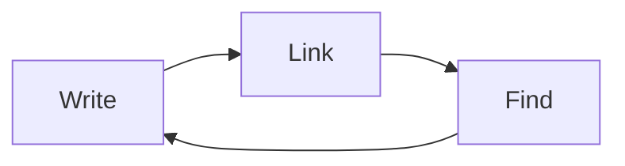

# Rich Content

## Callouts

> [!note] Callouts are blockquotes with a type
> Type `> [!note]` on a line and carry on writing.

> [!warning] They come in several kinds
> `note`, `tip`, `warning`, `danger`, `info` — and they collapse.

> [!tip]- Collapsed by default
> A `-` after the type folds it. Click the chevron to open.

## Maths

Inline, like $e^{i\pi} + 1 = 0$, and as a block:

$$\int_0^\infty e^{-x^2}\,dx = \frac{\sqrt{\pi}}{2}$$

Rendered natively in the editor as you type — no browser, no export step.

## Diagrams


```mermaid
flowchart LR
    Write --> Link
    Link --> Find
    Find --> Write
```

The View diagram button in a diagram's top-right corner shows it larger — pinch, double-click (double-tap on iPad) or use the zoom controls to go closer. In Edit, click the diagram itself to edit its source. In Markdown and Split, where a diagram is its source, the same button sits at the right-hand end of its first line.

## Tables

| Feature | Where |
|---|---|
| Callouts | this note |
| Maths | this note |
| Transclusion | [[Transclusion]] |

## Code

```swift
func greet(_ name: String) -> String {
    "Hello, \(name)"
}
```
