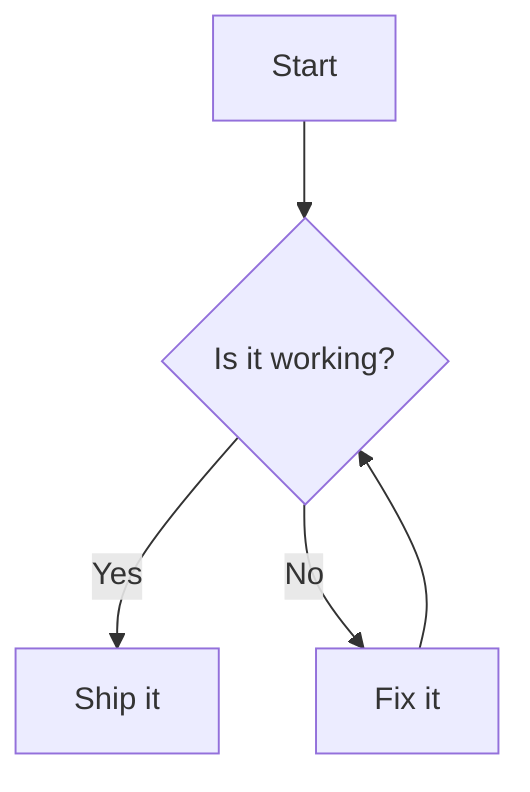
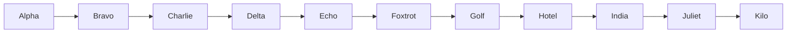

# Diagram Test

Some text before the diagram.

```mermaid
graph TD
    A[Start] --> B{Is it working?}
    B -->|Yes| C[Ship it]
    B -->|No| D[Fix it]
    D --> B
```

A wide diagram to test horizontal scrolling:

```mermaid
graph LR
    A[Alpha] --> B[Bravo] --> C[Charlie] --> D[Delta] --> E[Echo] --> F[Foxtrot] --> G[Golf] --> H[Hotel] --> I[India] --> J[Juliet] --> K[Kilo]
```

Some text after the diagram.
